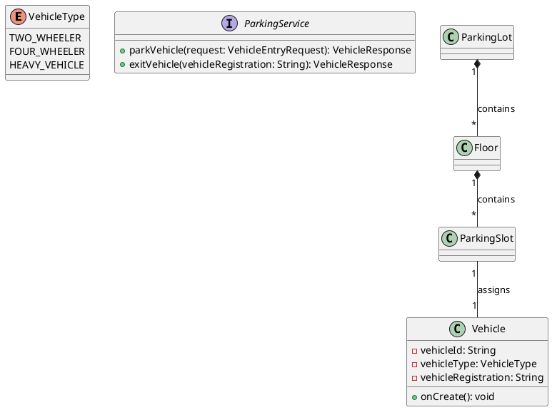

# UML Class Diagram Reference - Smart Parking Backend

Complete list of all classes, attributes, and methods for creating UML diagrams.

---

## 1. ENTITY CLASSES (Domain Model)

### Employee
**Package:** `com.smartparking.entity`

**Attributes:**
- `- empId: String` (PK)
- `- name: String`
- `- email: String`
- `- phNo: String`
- `- dob: LocalDate`
- `- gender: Gender`
- `- photo: String`
- `- address: String`
- `- roles: String`
- `- createdAt: LocalDateTime`
- `- updatedAt: LocalDateTime`

**Methods:**
- `# onCreate(): void`
- `# onUpdate(): void`

**Annotations:** @Entity, @Table

---

### Vehicle
**Package:** `com.smartparking.entity`

**Attributes:**
- `- vehicleId: String` (PK)
- `- vehicleType: VehicleType`
- `- vehicleRegistration: String`
- `- timeIn: LocalDateTime`
- `- timeOut: LocalDateTime`
- `- status: VehicleStatus`
- `- billAmt: Double`
- `- assignedSlot: ParkingSlot` (OneToOne)

**Methods:**
- `# onCreate(): void`

**Annotations:** @Entity, @Table

**Relationships:**
- OneToOne with ParkingSlot

---

### ParkingSlot
**Package:** `com.smartparking.entity`

**Attributes:**
- `- slotId: String` (PK)
- `- slotStatus: SlotStatus`
- `- slotType: SlotType`
- `- floor: Floor` (ManyToOne)
- `- currentVehicle: Vehicle` (OneToOne)

**Methods:**
- None (data class)

**Annotations:** @Entity, @Table

**Relationships:**
- ManyToOne with Floor
- OneToOne with Vehicle

---

### Floor
**Package:** `com.smartparking.entity`

**Attributes:**
- `- floorId: String` (PK)
- `- floorNo: Integer`
- `- totalSlots: Integer`
- `- allottedSlots: Integer`
- `- parkingLot: ParkingLot` (ManyToOne)
- `- slots: List<ParkingSlot>` (OneToMany)

**Methods:**
- `+ incrementAllottedSlots(): void`
- `+ decrementAllottedSlots(): void`

**Annotations:** @Entity, @Table

**Relationships:**
- ManyToOne with ParkingLot
- OneToMany with ParkingSlot

---

### ParkingLot
**Package:** `com.smartparking.entity`

**Attributes:**
- `- parkingLotId: String` (PK)
- `- name: String`
- `- address: String`
- `- totalFloors: Integer`
- `- floors: List<Floor>` (OneToMany)
- `- createdAt: LocalDateTime`
- `- updatedAt: LocalDateTime`

**Methods:**
- `# onCreate(): void`
- `# onUpdate(): void`

**Annotations:** @Entity, @Table

**Relationships:**
- OneToMany with Floor

---

## 2. ENUM CLASSES

### VehicleType
**Package:** `com.smartparking.enums`

**Values:**
- `TWO_WHEELER`
- `FOUR_WHEELER`
- `HEAVY_VEHICLE`

---

### SlotType
**Package:** `com.smartparking.enums`

**Values:**
- `TWO_WHEELER`
- `FOUR_WHEELER`
- `HEAVY_VEHICLE`

---

### SlotStatus
**Package:** `com.smartparking.enums`

**Values:**
- `AVAILABLE`
- `OCCUPIED`
- `RESERVED`
- `MAINTENANCE`

---

### VehicleStatus
**Package:** `com.smartparking.enums`

**Values:**
- `PARKED`
- `EXITED`
- `IN_PROCESS`

---

### Gender
**Package:** `com.smartparking.enums`

**Values:**
- `MALE`
- `FEMALE`
- `OTHER`

---

## 3. REPOSITORY INTERFACES (Data Access Layer)

### EmployeeRepository
**Package:** `com.smartparking.repository`

**Extends:** `JpaRepository<Employee, String>`

**Methods:**
- `+ findByEmail(email: String): Optional<Employee>`
- `+ existsByEmail(email: String): boolean`

**Annotations:** @Repository

---

### VehicleRepository
**Package:** `com.smartparking.repository`

**Extends:** `JpaRepository<Vehicle, String>`

**Methods:**
- `+ findByVehicleRegistration(vehicleRegistration: String): Optional<Vehicle>`
- `+ findByStatus(status: VehicleStatus): List<Vehicle>`
- `+ findByVehicleRegistrationAndStatus(vehicleRegistration: String, status: VehicleStatus): Optional<Vehicle>`

**Annotations:** @Repository

---

### ParkingSlotRepository
**Package:** `com.smartparking.repository`

**Extends:** `JpaRepository<ParkingSlot, String>`

**Methods:**
- `+ findBySlotStatusAndSlotType(slotStatus: SlotStatus, slotType: SlotType): List<ParkingSlot>`
- `+ findByFloorIdAndStatus(floorId: String, status: SlotStatus): List<ParkingSlot>`
- `+ findFirstBySlotTypeAndSlotStatus(slotType: SlotType, slotStatus: SlotStatus): Optional<ParkingSlot>`
- `+ countByFloorFloorIdAndSlotStatus(floorId: String, slotStatus: SlotStatus): long`

**Annotations:** @Repository

---

### FloorRepository
**Package:** `com.smartparking.repository`

**Extends:** `JpaRepository<Floor, String>`

**Methods:**
- `+ findByParkingLotParkingLotId(parkingLotId: String): List<Floor>`
- `+ findByParkingLotParkingLotIdAndFloorNo(parkingLotId: String, floorNo: Integer): Optional<Floor>`

**Annotations:** @Repository

---

### ParkingLotRepository
**Package:** `com.smartparking.repository`

**Extends:** `JpaRepository<ParkingLot, String>`

**Methods:**
- `+ findByName(name: String): Optional<ParkingLot>`

**Annotations:** @Repository

---

## 4. SERVICE INTERFACES (Business Logic Layer)

### EmployeeService
**Package:** `com.smartparking.service`

**Methods:**
- `+ createEmployee(request: EmployeeRequest): EmployeeResponse`
- `+ getEmployeeById(empId: String): EmployeeResponse`
- `+ getEmployeeByEmail(email: String): EmployeeResponse`
- `+ getAllEmployees(): List<EmployeeResponse>`
- `+ updateEmployee(empId: String, request: EmployeeRequest): EmployeeResponse`
- `+ deleteEmployee(empId: String): void`

---

### ParkingService
**Package:** `com.smartparking.service`

**Methods:**
- `+ parkVehicle(request: VehicleEntryRequest): VehicleResponse`
- `+ exitVehicle(vehicleRegistration: String): VehicleResponse`
- `+ getVehicleByRegistration(vehicleRegistration: String): VehicleResponse`

---

### ParkingLotService
**Package:** `com.smartparking.service`

**Methods:**
- `+ createParkingLot(request: ParkingLotRequest): ParkingLotResponse`
- `+ getParkingLotById(parkingLotId: String): ParkingLotResponse`
- `+ getAllParkingLots(): List<ParkingLotResponse>`
- `+ addFloor(request: FloorRequest): FloorResponse`
- `+ getFloorById(floorId: String): FloorResponse`
- `+ getFloorsByParkingLotId(parkingLotId: String): List<FloorResponse>`

---

### AuthService
**Package:** `com.smartparking.service`

**Methods:**
- `+ getUserInfo(uid: String): UserInfoResponse`
- `+ getCurrentUser(): UserInfoResponse`

---

## 5. SERVICE IMPLEMENTATIONS

### EmployeeServiceImpl
**Package:** `com.smartparking.service.impl`

**Implements:** `EmployeeService`

**Attributes:**
- `- employeeRepository: EmployeeRepository`

**Methods:**
- `+ createEmployee(request: EmployeeRequest): EmployeeResponse`
- `+ getEmployeeById(empId: String): EmployeeResponse`
- `+ getEmployeeByEmail(email: String): EmployeeResponse`
- `+ getAllEmployees(): List<EmployeeResponse>`
- `+ updateEmployee(empId: String, request: EmployeeRequest): EmployeeResponse`
- `+ deleteEmployee(empId: String): void`
- `- mapToResponse(employee: Employee): EmployeeResponse`

**Annotations:** @Service, @Transactional

---

### ParkingServiceImpl
**Package:** `com.smartparking.service.impl`

**Implements:** `ParkingService`

**Attributes:**
- `- vehicleRepository: VehicleRepository`
- `- parkingSlotRepository: ParkingSlotRepository`
- `- pricingStrategy: PricingStrategy`

**Methods:**
- `+ parkVehicle(request: VehicleEntryRequest): VehicleResponse`
- `+ exitVehicle(vehicleRegistration: String): VehicleResponse`
- `+ getVehicleByRegistration(vehicleRegistration: String): VehicleResponse`
- `- mapVehicleTypeToSlotType(vehicleType: VehicleType): SlotType`
- `- mapToResponse(vehicle: Vehicle): VehicleResponse`

**Annotations:** @Service, @Transactional

---

### ParkingLotServiceImpl
**Package:** `com.smartparking.service.impl`

**Implements:** `ParkingLotService`

**Attributes:**
- `- parkingLotRepository: ParkingLotRepository`
- `- floorRepository: FloorRepository`
- `- parkingSlotRepository: ParkingSlotRepository`

**Methods:**
- `+ createParkingLot(request: ParkingLotRequest): ParkingLotResponse`
- `+ getParkingLotById(parkingLotId: String): ParkingLotResponse`
- `+ getAllParkingLots(): List<ParkingLotResponse>`
- `+ addFloor(request: FloorRequest): FloorResponse`
- `+ getFloorById(floorId: String): FloorResponse`
- `+ getFloorsByParkingLotId(parkingLotId: String): List<FloorResponse>`
- `- mapToParkingLotResponse(parkingLot: ParkingLot): ParkingLotResponse`
- `- mapToFloorResponse(floor: Floor): FloorResponse`
- `- mapToSlotResponse(slot: ParkingSlot): ParkingSlotResponse`

**Annotations:** @Service, @Transactional

---

### AuthServiceImpl
**Package:** `com.smartparking.service.impl`

**Implements:** `AuthService`

**Attributes:**
- None (uses Firebase Auth directly)

**Methods:**
- `+ getUserInfo(uid: String): UserInfoResponse`
- `+ getCurrentUser(): UserInfoResponse`
- `- mapToUserInfoResponse(userRecord: UserRecord): UserInfoResponse`

**Annotations:** @Service

---

## 6. STRATEGY PATTERN (Pricing)

### PricingStrategy <<interface>>
**Package:** `com.smartparking.service.strategy`

**Methods:**
- `+ calculatePrice(vehicleType: VehicleType, parkingDuration: Duration): double`

---

### DefaultPricingStrategy
**Package:** `com.smartparking.service.strategy`

**Implements:** `PricingStrategy`

**Attributes:**
- `- TWO_WHEELER_BASE_RATE: double = 10.0`
- `- FOUR_WHEELER_BASE_RATE: double = 20.0`
- `- HEAVY_VEHICLE_BASE_RATE: double = 40.0`
- `- MINIMUM_CHARGE: double = 5.0`

**Methods:**
- `+ calculatePrice(vehicleType: VehicleType, parkingDuration: Duration): double`

**Annotations:** @Component

---

## 7. CONTROLLER CLASSES (REST API Layer)

### EmployeeController
**Package:** `com.smartparking.controller`

**Attributes:**
- `- employeeService: EmployeeService`

**Methods:**
- `+ createEmployee(request: EmployeeRequest): ResponseEntity<ApiResponse<EmployeeResponse>>`
- `+ getEmployeeById(empId: String): ResponseEntity<ApiResponse<EmployeeResponse>>`
- `+ getEmployeeByEmail(email: String): ResponseEntity<ApiResponse<EmployeeResponse>>`
- `+ getAllEmployees(): ResponseEntity<ApiResponse<List<EmployeeResponse>>>`
- `+ updateEmployee(empId: String, request: EmployeeRequest): ResponseEntity<ApiResponse<EmployeeResponse>>`
- `+ deleteEmployee(empId: String): ResponseEntity<ApiResponse<Void>>`

**Annotations:** @RestController, @RequestMapping("/api/employees")

---

### ParkingController
**Package:** `com.smartparking.controller`

**Attributes:**
- `- parkingService: ParkingService`

**Methods:**
- `+ parkVehicle(request: VehicleEntryRequest): ResponseEntity<ApiResponse<VehicleResponse>>`
- `+ exitVehicle(vehicleRegistration: String): ResponseEntity<ApiResponse<VehicleResponse>>`
- `+ getVehicle(vehicleRegistration: String): ResponseEntity<ApiResponse<VehicleResponse>>`

**Annotations:** @RestController, @RequestMapping("/api/parking")

---

### ParkingLotController
**Package:** `com.smartparking.controller`

**Attributes:**
- `- parkingLotService: ParkingLotService`

**Methods:**
- `+ createParkingLot(request: ParkingLotRequest): ResponseEntity<ApiResponse<ParkingLotResponse>>`
- `+ getParkingLotById(parkingLotId: String): ResponseEntity<ApiResponse<ParkingLotResponse>>`
- `+ getAllParkingLots(): ResponseEntity<ApiResponse<List<ParkingLotResponse>>>`
- `+ addFloor(request: FloorRequest): ResponseEntity<ApiResponse<FloorResponse>>`
- `+ getFloorById(floorId: String): ResponseEntity<ApiResponse<FloorResponse>>`
- `+ getFloorsByParkingLotId(parkingLotId: String): ResponseEntity<ApiResponse<List<FloorResponse>>>`

**Annotations:** @RestController, @RequestMapping("/api/parking-lots")

---

### AuthController
**Package:** `com.smartparking.controller`

**Attributes:**
- `- authService: AuthService`

**Methods:**
- `+ getCurrentUser(): ResponseEntity<ApiResponse<UserInfoResponse>>`
- `+ getUserInfo(uid: String): ResponseEntity<ApiResponse<UserInfoResponse>>`
- `+ verifyToken(): ResponseEntity<ApiResponse<String>>`

**Annotations:** @RestController, @RequestMapping("/api/auth")

---

### HealthController
**Package:** `com.smartparking.controller`

**Attributes:**
- None

**Methods:**
- `+ health(): ResponseEntity<ApiResponse<Map<String, Object>>>`
- `+ welcome(): ResponseEntity<ApiResponse<Map<String, String>>>`

**Annotations:** @RestController, @RequestMapping("/api")

---

## 8. DTO CLASSES - REQUEST

### EmployeeRequest
**Package:** `com.smartparking.dto.request`

**Attributes:**
- `- name: String`
- `- email: String`
- `- phNo: String`
- `- dob: LocalDate`
- `- gender: Gender`
- `- photo: String`
- `- address: String`
- `- roles: String`

**Annotations:** @Data, @Validated

---

### VehicleEntryRequest
**Package:** `com.smartparking.dto.request`

**Attributes:**
- `- vehicleType: VehicleType`
- `- vehicleRegistration: String`

**Annotations:** @Data, @Validated

---

### ParkingLotRequest
**Package:** `com.smartparking.dto.request`

**Attributes:**
- `- name: String`
- `- address: String`
- `- totalFloors: Integer`

**Annotations:** @Data, @Validated

---

### FloorRequest
**Package:** `com.smartparking.dto.request`

**Attributes:**
- `- floorNo: Integer`
- `- parkingLotId: String`
- `- slotConfiguration: Map<SlotType, Integer>`

**Annotations:** @Data, @Validated

---

### AuthRequest
**Package:** `com.smartparking.dto.request`

**Attributes:**
- `- email: String`
- `- password: String`

**Annotations:** @Data, @Validated

---

## 9. DTO CLASSES - RESPONSE

### EmployeeResponse
**Package:** `com.smartparking.dto.response`

**Attributes:**
- `- empId: String`
- `- name: String`
- `- email: String`
- `- phNo: String`
- `- dob: LocalDate`
- `- gender: Gender`
- `- photo: String`
- `- address: String`
- `- roles: String`
- `- createdAt: LocalDateTime`
- `- updatedAt: LocalDateTime`

**Annotations:** @Data

---

### VehicleResponse
**Package:** `com.smartparking.dto.response`

**Attributes:**
- `- vehicleId: String`
- `- vehicleType: VehicleType`
- `- vehicleRegistration: String`
- `- timeIn: LocalDateTime`
- `- timeOut: LocalDateTime`
- `- status: VehicleStatus`
- `- billAmt: Double`
- `- assignedSlotId: String`

**Annotations:** @Data

---

### ParkingSlotResponse
**Package:** `com.smartparking.dto.response`

**Attributes:**
- `- slotId: String`
- `- slotStatus: SlotStatus`
- `- slotType: SlotType`
- `- floorId: String`
- `- currentVehicleId: String`

**Annotations:** @Data

---

### FloorResponse
**Package:** `com.smartparking.dto.response`

**Attributes:**
- `- floorId: String`
- `- floorNo: Integer`
- `- totalSlots: Integer`
- `- allottedSlots: Integer`
- `- availableSlots: Integer`
- `- parkingLotId: String`
- `- slots: List<ParkingSlotResponse>`

**Annotations:** @Data

---

### ParkingLotResponse
**Package:** `com.smartparking.dto.response`

**Attributes:**
- `- parkingLotId: String`
- `- name: String`
- `- address: String`
- `- totalFloors: Integer`
- `- floors: List<FloorResponse>`
- `- createdAt: LocalDateTime`
- `- updatedAt: LocalDateTime`

**Annotations:** @Data

---

### ApiResponse<T>
**Package:** `com.smartparking.dto.response`

**Attributes:**
- `- success: boolean`
- `- message: String`
- `- data: T`

**Methods:**
- `+ success(message: String, data: T): ApiResponse<T>`
- `+ error(message: String): ApiResponse<T>`

**Annotations:** @Data

---

### AuthResponse
**Package:** `com.smartparking.dto.response`

**Attributes:**
- `- uid: String`
- `- email: String`
- `- idToken: String`
- `- refreshToken: String`
- `- expiresIn: long`

**Annotations:** @Data

---

### UserInfoResponse
**Package:** `com.smartparking.dto.response`

**Attributes:**
- `- uid: String`
- `- email: String`
- `- displayName: String`
- `- photoUrl: String`
- `- emailVerified: boolean`

**Annotations:** @Data

---

## 10. EXCEPTION CLASSES

### ResourceNotFoundException
**Package:** `com.smartparking.exception`

**Extends:** `RuntimeException`

**Attributes:**
- None

**Methods:**
- `+ ResourceNotFoundException(message: String)`

---

### DuplicateResourceException
**Package:** `com.smartparking.exception`

**Extends:** `RuntimeException`

**Attributes:**
- None

**Methods:**
- `+ DuplicateResourceException(message: String)`

---

### NoAvailableSlotException
**Package:** `com.smartparking.exception`

**Extends:** `RuntimeException`

**Attributes:**
- None

**Methods:**
- `+ NoAvailableSlotException(message: String)`

---

### InvalidOperationException
**Package:** `com.smartparking.exception`

**Extends:** `RuntimeException`

**Attributes:**
- None

**Methods:**
- `+ InvalidOperationException(message: String)`

---

### GlobalExceptionHandler
**Package:** `com.smartparking.exception`

**Attributes:**
- None

**Methods:**
- `+ handleResourceNotFoundException(ex: ResourceNotFoundException): ResponseEntity<ApiResponse<?>>`
- `+ handleDuplicateResourceException(ex: DuplicateResourceException): ResponseEntity<ApiResponse<?>>`
- `+ handleNoAvailableSlotException(ex: NoAvailableSlotException): ResponseEntity<ApiResponse<?>>`
- `+ handleInvalidOperationException(ex: InvalidOperationException): ResponseEntity<ApiResponse<?>>`
- `+ handleValidationExceptions(ex: MethodArgumentNotValidException): ResponseEntity<ApiResponse<Map<String, String>>>`
- `+ handleGlobalException(ex: Exception): ResponseEntity<ApiResponse<?>>`

**Annotations:** @RestControllerAdvice

---

## 11. SECURITY CLASSES

### FirebaseConfig
**Package:** `com.smartparking.config`

**Attributes:**
- `- firebaseConfigFile: String`

**Methods:**
- `+ initializeFirebase(): FirebaseApp`

**Annotations:** @Configuration

---

### SecurityConfig
**Package:** `com.smartparking.config`

**Attributes:**
- `- firebaseAuthenticationFilter: FirebaseAuthenticationFilter`

**Methods:**
- `+ securityFilterChain(http: HttpSecurity): SecurityFilterChain`
- `+ corsConfigurationSource(): CorsConfigurationSource`

**Annotations:** @Configuration, @EnableWebSecurity

---

### FirebaseAuthenticationFilter
**Package:** `com.smartparking.security`

**Extends:** `OncePerRequestFilter`

**Attributes:**
- None

**Methods:**
- `# doFilterInternal(request: HttpServletRequest, response: HttpServletResponse, filterChain: FilterChain): void`

**Annotations:** @Component

---

## 12. MAIN APPLICATION CLASS

### SmartParkingApplication
**Package:** `com.smartparking`

**Attributes:**
- None

**Methods:**
- `+ main(args: String[]): void`

**Annotations:** @SpringBootApplication

---

## CLASS RELATIONSHIPS SUMMARY

### Entity Relationships:
1. **ParkingLot** (1) ←→ (*) **Floor**
2. **Floor** (1) ←→ (*) **ParkingSlot**
3. **ParkingSlot** (1) ←→ (1) **Vehicle**
4. **Employee** (standalone entity)

### Service Dependencies:
1. **Controller** → **Service** → **Repository** → **Entity**
2. **ParkingServiceImpl** → **PricingStrategy**
3. **All Services** → **Repositories**

### Exception Handling:
1. **All Controllers** → **GlobalExceptionHandler**

### Security:
1. **SecurityConfig** → **FirebaseAuthenticationFilter**
2. **FirebaseConfig** → Firebase Admin SDK

---

## UML DIAGRAM GROUPS

For clarity, I recommend creating **4 separate diagrams**:

### Diagram 1: Domain Model (Entities)
- Employee
- ParkingLot
- Floor
- ParkingSlot
- Vehicle
- All Enums

### Diagram 2: Service Layer
- Service Interfaces
- Service Implementations
- PricingStrategy
- Repository Interfaces

### Diagram 3: API Layer
- All Controllers
- Request DTOs
- Response DTOs
- GlobalExceptionHandler

### Diagram 4: Security Layer
- FirebaseConfig
- SecurityConfig
- FirebaseAuthenticationFilter
- AuthService

---

## PlantUML Syntax Hints

---

This document contains everything you need for your UML class diagram!
