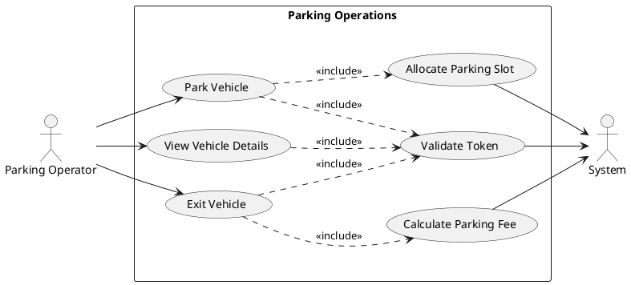

# Use Case Diagram Reference - Smart Parking Backend

Complete list of all use cases, actors, and relationships for creating UML Use Case Diagrams.

---

## ACTORS

### 1. **Parking Operator** (Primary Actor)
- Manages day-to-day parking operations
- Handles vehicle entry and exit
- Manages parking slots

### 2. **Admin/Manager** (Primary Actor)
- Manages the parking lot infrastructure
- Manages employee accounts
- Configures pricing and settings

### 3. **System** (Secondary Actor)
- Firebase Authentication System
- Automatic billing system
- Slot allocation system

### 4. **Guest/Public User** (Primary Actor)
- Views system health/status
- No authentication required

---

## USE CASES BY FEATURE AREA

## 1. PARKING OPERATIONS (Operator)

### UC-01: Park Vehicle
**Actor:** Parking Operator
**Description:** Register a vehicle entering the parking lot and assign a parking slot
**Preconditions:**
- Operator is authenticated
- Available parking slots exist

**Main Flow:**
1. Operator enters vehicle registration number
2. Operator selects vehicle type (Two Wheeler/Four Wheeler/Heavy Vehicle)
3. System finds available slot matching vehicle type
4. System assigns slot to vehicle
5. System records entry time
6. System displays assigned slot information

**Alternative Flow:**
- 3a. No available slots → System shows "No available slots" error

**Postconditions:**
- Vehicle is parked
- Slot is marked as OCCUPIED
- Floor allotted slots count is incremented

**API Endpoint:** `POST /api/parking/entry`

---

### UC-02: Exit Vehicle (Generate Bill)
**Actor:** Parking Operator
**Description:** Process vehicle exit and generate parking bill
**Preconditions:**
- Operator is authenticated
- Vehicle is currently parked

**Main Flow:**
1. Operator enters vehicle registration number
2. System retrieves vehicle parking details
3. System calculates parking duration
4. System applies pricing strategy based on vehicle type
5. System generates bill
6. System marks slot as AVAILABLE
7. System records exit time
8. System displays bill to operator

**Alternative Flow:**
- 2a. Vehicle not found → System shows error

**Postconditions:**
- Vehicle status is EXITED
- Slot is available for next vehicle
- Floor allotted slots count is decremented
- Bill is generated

**API Endpoint:** `POST /api/parking/exit/{vehicleRegistration}`

---

### UC-03: View Vehicle Details
**Actor:** Parking Operator
**Description:** Check details of a parked vehicle
**Preconditions:**
- Operator is authenticated

**Main Flow:**
1. Operator enters vehicle registration number
2. System retrieves vehicle information
3. System displays vehicle details (type, entry time, assigned slot, status)

**Postconditions:**
- Vehicle information is displayed

**API Endpoint:** `GET /api/parking/vehicle/{vehicleRegistration}`

---

## 2. PARKING LOT MANAGEMENT (Admin)

### UC-04: Create Parking Lot
**Actor:** Admin
**Description:** Set up a new parking lot in the system
**Preconditions:**
- Admin is authenticated

**Main Flow:**
1. Admin enters parking lot name
2. Admin enters parking lot address
3. Admin specifies total number of floors
4. System creates parking lot
5. System returns parking lot ID

**Alternative Flow:**
- 4a. Parking lot name already exists → System shows error

**Postconditions:**
- New parking lot is created in system

**API Endpoint:** `POST /api/parking-lots`

---

### UC-05: View All Parking Lots
**Actor:** Admin
**Description:** View list of all parking lots
**Preconditions:**
- Admin is authenticated

**Main Flow:**
1. Admin requests parking lot list
2. System retrieves all parking lots
3. System displays parking lot information

**Postconditions:**
- Parking lot list is displayed

**API Endpoint:** `GET /api/parking-lots`

---

### UC-06: View Parking Lot Details
**Actor:** Admin/Operator
**Description:** View detailed information about a specific parking lot
**Preconditions:**
- User is authenticated

**Main Flow:**
1. User selects parking lot
2. System retrieves parking lot details with all floors
3. System displays parking lot information

**Postconditions:**
- Parking lot details are displayed

**API Endpoint:** `GET /api/parking-lots/{parkingLotId}`

---

### UC-07: Add Floor to Parking Lot
**Actor:** Admin
**Description:** Add a new floor with parking slots to existing parking lot
**Preconditions:**
- Admin is authenticated
- Parking lot exists

**Main Flow:**
1. Admin selects parking lot
2. Admin enters floor number
3. Admin configures slot distribution:
   - Number of two-wheeler slots
   - Number of four-wheeler slots
   - Number of heavy vehicle slots
4. System creates floor
5. System creates all parking slots based on configuration
6. System returns floor details

**Alternative Flow:**
- 3a. Floor already exists → System shows error

**Postconditions:**
- New floor is added
- Parking slots are created and marked as AVAILABLE

**API Endpoint:** `POST /api/parking-lots/floors`

---

### UC-08: View Floor Details
**Actor:** Admin/Operator
**Description:** View details of a specific floor including all slots
**Preconditions:**
- User is authenticated

**Main Flow:**
1. User selects floor
2. System retrieves floor information
3. System displays floor details (total slots, occupied slots, available slots)
4. System displays all slot information

**Postconditions:**
- Floor details are displayed

**API Endpoint:** `GET /api/parking-lots/floors/{floorId}`

---

### UC-09: View Floors by Parking Lot
**Actor:** Admin/Operator
**Description:** View all floors in a specific parking lot
**Preconditions:**
- User is authenticated

**Main Flow:**
1. User selects parking lot
2. System retrieves all floors for that parking lot
3. System displays floor list with statistics

**Postconditions:**
- Floor list is displayed

**API Endpoint:** `GET /api/parking-lots/{parkingLotId}/floors`

---

## 3. EMPLOYEE MANAGEMENT (Admin)

### UC-10: Create Employee Account
**Actor:** Admin
**Description:** Register a new employee in the system
**Preconditions:**
- Admin is authenticated

**Main Flow:**
1. Admin enters employee details:
   - Name
   - Email
   - Phone number
   - Date of birth
   - Gender
   - Photo URL
   - Address
   - Role (Operator, Manager, etc.)
2. System validates email uniqueness
3. System creates employee account
4. System returns employee information

**Alternative Flow:**
- 2a. Email already exists → System shows duplicate error

**Postconditions:**
- Employee account is created

**API Endpoint:** `POST /api/employees`

---

### UC-11: View All Employees
**Actor:** Admin
**Description:** View list of all employees
**Preconditions:**
- Admin is authenticated

**Main Flow:**
1. Admin requests employee list
2. System retrieves all employees
3. System displays employee information

**Postconditions:**
- Employee list is displayed

**API Endpoint:** `GET /api/employees`

---

### UC-12: View Employee Details (by ID)
**Actor:** Admin
**Description:** View detailed information about a specific employee
**Preconditions:**
- Admin is authenticated

**Main Flow:**
1. Admin enters employee ID
2. System retrieves employee information
3. System displays employee details

**Alternative Flow:**
- 2a. Employee not found → System shows error

**Postconditions:**
- Employee details are displayed

**API Endpoint:** `GET /api/employees/{empId}`

---

### UC-13: View Employee Details (by Email)
**Actor:** Admin
**Description:** Search and view employee by email address
**Preconditions:**
- Admin is authenticated

**Main Flow:**
1. Admin enters employee email
2. System searches for employee
3. System displays employee details

**Alternative Flow:**
- 2a. Employee not found → System shows error

**Postconditions:**
- Employee details are displayed

**API Endpoint:** `GET /api/employees/email/{email}`

---

### UC-14: Update Employee Information
**Actor:** Admin
**Description:** Modify existing employee details
**Preconditions:**
- Admin is authenticated
- Employee exists

**Main Flow:**
1. Admin selects employee
2. Admin modifies employee information
3. System validates new email (if changed)
4. System updates employee record
5. System returns updated employee information

**Alternative Flow:**
- 3a. New email already exists → System shows error

**Postconditions:**
- Employee information is updated

**API Endpoint:** `PUT /api/employees/{empId}`

---

### UC-15: Delete Employee Account
**Actor:** Admin
**Description:** Remove employee from the system
**Preconditions:**
- Admin is authenticated
- Employee exists

**Main Flow:**
1. Admin selects employee to delete
2. System confirms deletion
3. System removes employee account

**Alternative Flow:**
- 3a. Employee not found → System shows error

**Postconditions:**
- Employee account is deleted

**API Endpoint:** `DELETE /api/employees/{empId}`

---

## 4. AUTHENTICATION & USER MANAGEMENT

### UC-16: Login with Firebase
**Actor:** Admin/Operator
**Description:** Authenticate user using Firebase
**Preconditions:**
- User has Firebase account

**Main Flow:**
1. User enters email and password in frontend
2. Frontend authenticates with Firebase
3. Firebase returns ID token
4. Frontend sends requests with token to backend
5. Backend verifies token with Firebase
6. Backend grants access to protected resources

**Alternative Flow:**
- 5a. Invalid token → Backend returns 401 Unauthorized

**Postconditions:**
- User is authenticated
- User can access protected APIs

**Integration:** Firebase Authentication

---

### UC-17: View Current User Profile
**Actor:** Admin/Operator
**Description:** View logged-in user's profile information
**Preconditions:**
- User is authenticated

**Main Flow:**
1. User requests own profile
2. System retrieves current user info from Firebase
3. System displays user profile

**Postconditions:**
- User profile is displayed

**API Endpoint:** `GET /api/auth/me`

---

### UC-18: View User by UID
**Actor:** Admin
**Description:** View any user's profile by Firebase UID
**Preconditions:**
- Admin is authenticated

**Main Flow:**
1. Admin enters user UID
2. System retrieves user info from Firebase
3. System displays user profile

**Alternative Flow:**
- 2a. User not found → System shows error

**Postconditions:**
- User profile is displayed

**API Endpoint:** `GET /api/auth/user/{uid}`

---

### UC-19: Verify Authentication Token
**Actor:** Admin/Operator
**Description:** Verify if authentication token is valid
**Preconditions:**
- User has token

**Main Flow:**
1. User sends token to backend
2. System verifies token with Firebase
3. System confirms token validity

**Alternative Flow:**
- 2a. Invalid/expired token → System returns error

**Postconditions:**
- Token validity is confirmed

**API Endpoint:** `POST /api/auth/verify-token`

---

## 5. SYSTEM MONITORING (Public)

### UC-20: Check System Health
**Actor:** Guest/Public User
**Description:** Verify system is running and operational
**Preconditions:** None

**Main Flow:**
1. User requests health check
2. System returns status information:
   - Service status (UP/DOWN)
   - Timestamp
   - Version
3. System displays health information

**Postconditions:**
- Health status is displayed

**API Endpoint:** `GET /api/health`

---

### UC-21: View API Welcome/Info
**Actor:** Guest/Public User
**Description:** Get basic API information
**Preconditions:** None

**Main Flow:**
1. User requests API root endpoint
2. System returns welcome message
3. System provides links to documentation

**Postconditions:**
- API information is displayed

**API Endpoint:** `GET /api`

---

## 6. AUTOMATIC SYSTEM OPERATIONS

### UC-22: Calculate Parking Fee
**Actor:** System (Pricing Strategy)
**Description:** Automatically calculate parking charges based on duration and vehicle type
**Triggered by:** UC-02 (Exit Vehicle)

**Main Flow:**
1. System retrieves vehicle entry time
2. System calculates parking duration
3. System identifies vehicle type
4. System applies pricing strategy:
   - Two Wheeler: ₹10/hour
   - Four Wheeler: ₹20/hour
   - Heavy Vehicle: ₹40/hour
   - Minimum charge: ₹5
5. System rounds up to nearest hour
6. System calculates total amount

**Postconditions:**
- Parking fee is calculated

**Component:** DefaultPricingStrategy

---

### UC-23: Allocate Parking Slot
**Actor:** System (Slot Allocation)
**Description:** Automatically find and assign appropriate parking slot
**Triggered by:** UC-01 (Park Vehicle)

**Main Flow:**
1. System identifies vehicle type
2. System maps vehicle type to slot type
3. System searches for first available slot of matching type
4. System assigns slot to vehicle
5. System marks slot as OCCUPIED
6. System increments floor's allotted slots counter

**Alternative Flow:**
- 3a. No available slots → System throws NoAvailableSlotException

**Postconditions:**
- Slot is allocated to vehicle

**Component:** ParkingServiceImpl

---

### UC-24: Validate Firebase Token
**Actor:** System (Security Filter)
**Description:** Automatically verify Firebase authentication token on each API request
**Triggered by:** Every protected API request

**Main Flow:**
1. System intercepts HTTP request
2. System extracts Bearer token from Authorization header
3. System verifies token with Firebase
4. System retrieves user information (UID, email)
5. System sets Spring Security authentication context
6. System allows request to proceed

**Alternative Flow:**
- 3a. Invalid token → System returns 401 Unauthorized
- 2a. No token → System allows if public endpoint, blocks if protected

**Postconditions:**
- Request is authenticated or rejected

**Component:** FirebaseAuthenticationFilter

---

## USE CASE RELATIONSHIPS

### <<include>> Relationships:
1. **UC-01 (Park Vehicle)** includes **UC-23 (Allocate Parking Slot)**
2. **UC-02 (Exit Vehicle)** includes **UC-22 (Calculate Parking Fee)**
3. **UC-01, UC-02, UC-03** include **UC-24 (Validate Firebase Token)**
4. All Admin use cases include **UC-24 (Validate Firebase Token)**

### <<extend>> Relationships:
1. **UC-03 (View Vehicle Details)** extends **UC-02 (Exit Vehicle)**
2. **UC-06 (View Parking Lot Details)** extends **UC-04 (Create Parking Lot)**
3. **UC-08 (View Floor Details)** extends **UC-07 (Add Floor)**

### Generalization:
1. **Admin** and **Operator** are both types of **Authenticated User**
2. **UC-12 (View Employee by ID)** and **UC-13 (View Employee by Email)** are variations of viewing employee details

---

## USE CASE GROUPING FOR DIAGRAMS

### Diagram 1: Parking Operations
**Actors:** Operator, System
**Use Cases:**
- UC-01: Park Vehicle
- UC-02: Exit Vehicle
- UC-03: View Vehicle Details
- UC-22: Calculate Parking Fee (included)
- UC-23: Allocate Parking Slot (included)

---

### Diagram 2: Parking Lot Management
**Actors:** Admin, Operator
**Use Cases:**
- UC-04: Create Parking Lot
- UC-05: View All Parking Lots
- UC-06: View Parking Lot Details
- UC-07: Add Floor to Parking Lot
- UC-08: View Floor Details
- UC-09: View Floors by Parking Lot

---

### Diagram 3: Employee Management
**Actors:** Admin
**Use Cases:**
- UC-10: Create Employee Account
- UC-11: View All Employees
- UC-12: View Employee Details (by ID)
- UC-13: View Employee Details (by Email)
- UC-14: Update Employee Information
- UC-15: Delete Employee Account

---

### Diagram 4: Authentication & Security
**Actors:** Admin, Operator, System
**Use Cases:**
- UC-16: Login with Firebase
- UC-17: View Current User Profile
- UC-18: View User by UID
- UC-19: Verify Authentication Token
- UC-24: Validate Firebase Token (automatic)

---

### Diagram 5: System Monitoring
**Actors:** Guest/Public User
**Use Cases:**
- UC-20: Check System Health
- UC-21: View API Welcome/Info

---

## USE CASE PRIORITIES

### Critical (Must Have):
- UC-01: Park Vehicle
- UC-02: Exit Vehicle
- UC-04: Create Parking Lot
- UC-07: Add Floor to Parking Lot
- UC-16: Login with Firebase
- UC-22: Calculate Parking Fee
- UC-23: Allocate Parking Slot
- UC-24: Validate Firebase Token

### High Priority:
- UC-03: View Vehicle Details
- UC-06: View Parking Lot Details
- UC-08: View Floor Details
- UC-10: Create Employee Account
- UC-17: View Current User Profile

### Medium Priority:
- UC-05: View All Parking Lots
- UC-09: View Floors by Parking Lot
- UC-11: View All Employees
- UC-12: View Employee Details (by ID)
- UC-14: Update Employee Information
- UC-18: View User by UID

### Low Priority:
- UC-13: View Employee Details (by Email)
- UC-15: Delete Employee Account
- UC-19: Verify Authentication Token
- UC-20: Check System Health
- UC-21: View API Welcome/Info

---

## FUTURE USE CASES (NOT YET IMPLEMENTED)

These are potential extensions for future development:

### UC-25: Reserve Parking Slot
**Actor:** Customer (via Mobile App)
**Description:** Pre-book a parking slot before arrival

### UC-26: Make Payment
**Actor:** Customer
**Description:** Pay parking fee online via payment gateway

### UC-27: Generate Reports
**Actor:** Admin
**Description:** Generate analytics and revenue reports

### UC-28: Configure Pricing Rules
**Actor:** Admin
**Description:** Modify pricing strategy dynamically

### UC-29: Send Notifications
**Actor:** System
**Description:** Send SMS/Email notifications to customers

### UC-30: View Parking History
**Actor:** Customer
**Description:** View past parking sessions

### UC-31: Scan QR Code for Entry/Exit
**Actor:** Customer/Operator
**Description:** Use QR codes for faster vehicle processing

### UC-32: Monitor CCTV Feeds
**Actor:** Security Personnel
**Description:** View security camera feeds

---

## PlantUML Syntax Example

---

## SUMMARY

**Total Use Cases:** 24 (implemented) + 8 (future)

**By Actor:**
- **Admin:** 9 use cases (UC-04 to UC-15, except UC-12/UC-13 shared)
- **Operator:** 3 use cases (UC-01 to UC-03)
- **System:** 3 automatic use cases (UC-22 to UC-24)
- **Admin/Operator:** 5 shared use cases (UC-06, UC-08, UC-09, UC-17, UC-18)
- **Public:** 2 use cases (UC-20, UC-21)

**API Coverage:**
- ✅ All 24 implemented use cases map to existing API endpoints
- ✅ All controllers and services support the use cases
- ✅ Complete CRUD operations for all entities

This document provides everything you need to create comprehensive Use Case Diagrams! 🎯
